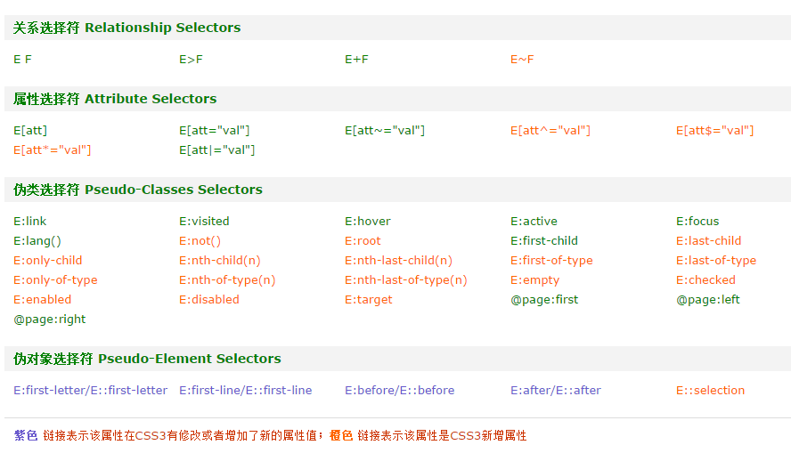

# js元素选择器库

重造轮子，JUST FUN~~

## 支持的选择方式：
> PS:伪类选择符使用频率比较少，所以独立出来，需要时额外引入[pseudo.js](./lib/pseudo.js)
> 伪类选择器实现有：
* first-of-type
* last-of-type
* only-of-type
* empty
* checked
* target
* enabled
* disabled
* not
* nth-child
* nth-last-child

